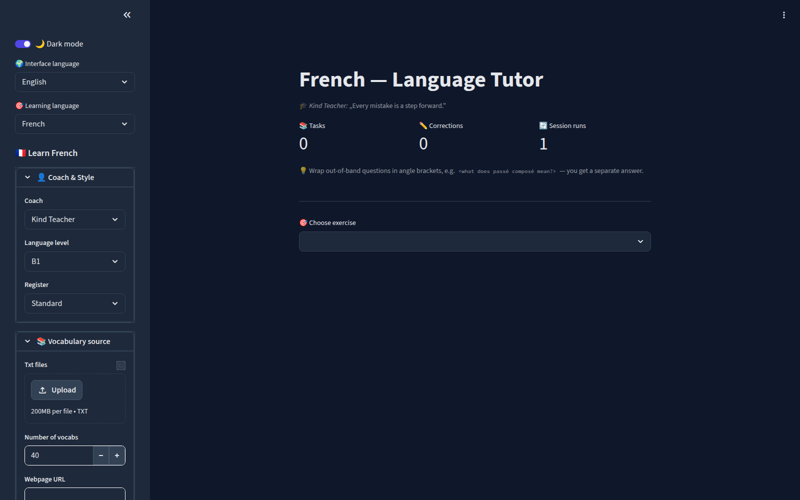
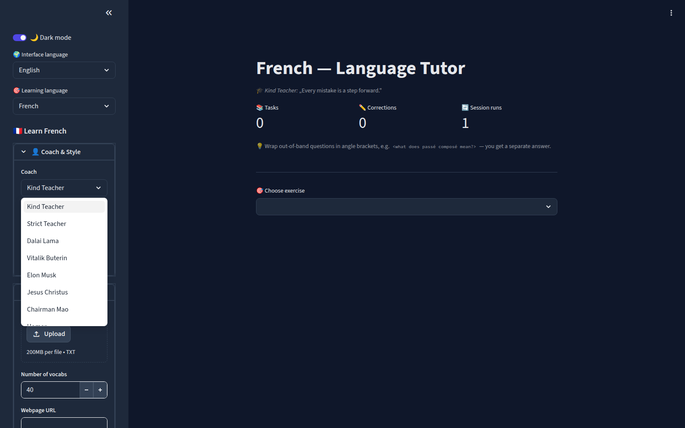
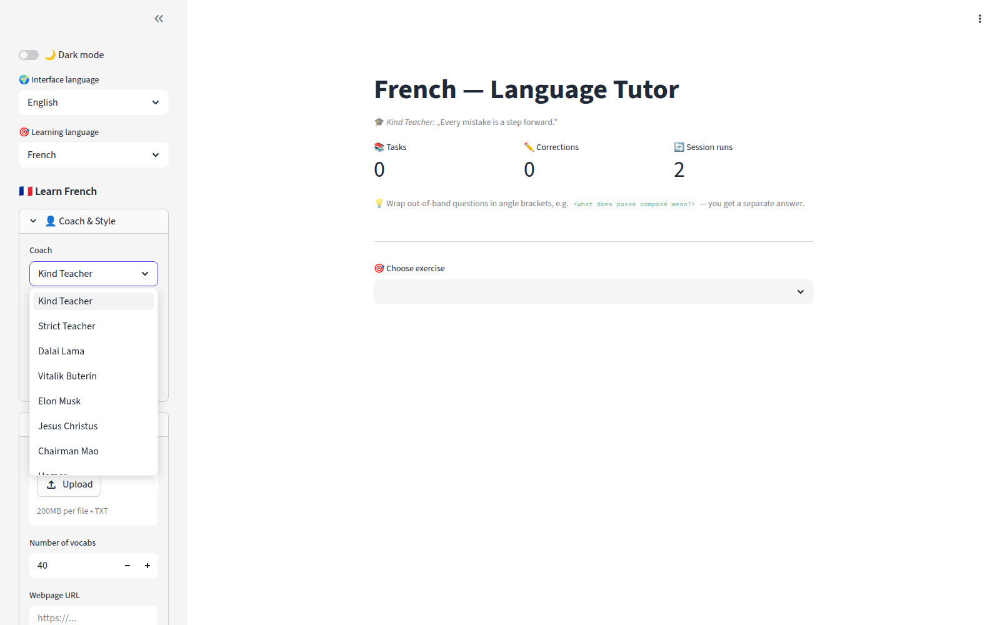
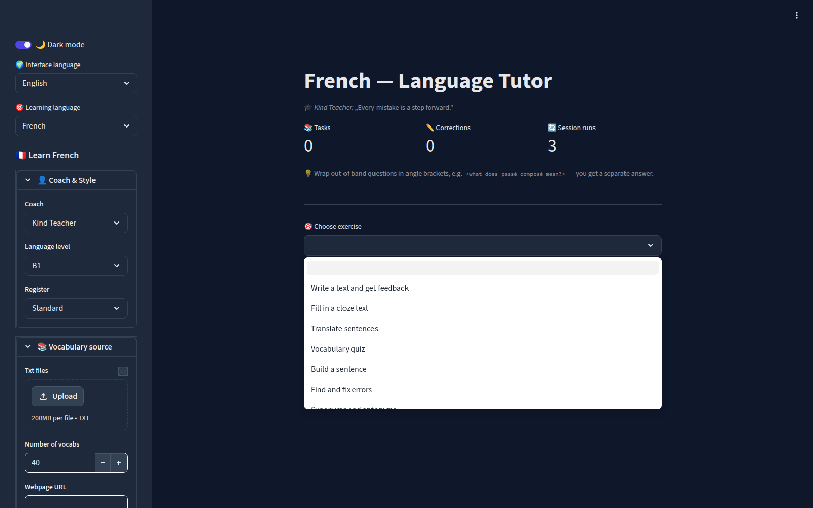

# lingua-app — AI Language Tutor

> A BYOK-first, multilingual AI language tutor built with Streamlit and OpenRouter.
> Nine exercise types including audio dictation. Mentor personas from Machiavelli to the
> Dalai Lama. Register-aware corrections from criminal slang to literary register.




## What makes it different

Most language apps offer one tone. This one models **seven registers** (criminal slang
→ vulgar → colloquial → standard → formal → literary → technical) and routes your
corrections through **ten mentor personas** — the combination gives you a tutor that
can meet you wherever you're writing, from street-level banter to Sorbonne-polished
prose. The stylistic contrast between coaches makes errors memorable.

Built originally to practise French at C1-level, then generalised into a modular,
tested, seven-language tool.

- **Register-aware corrections** — Slang / Vulgar / Colloquial / Standard / Formal /
  Literary / Technical. Mainstream apps don't model register; the stronger LLMs do,
  and this tool forces the correction feedback to match the register you're writing in.
- **Ten mentor personas** — a single dropdown switches the voice of the corrector from
  Kind Teacher to Machiavelli to Chairman Mao to Elon Musk. The stylistic contrast
  makes errors memorable. ()
- **Nine exercise types** from one shared vocabulary pool:
  writing, cloze, translation (both directions), sentence-building, error-detection,
  synonym/antonym, verb conjugation, vocabulary quiz, and **audio dictation with a
  playback-speed slider**.
- **Audio dictation (ElevenLabs)** — LLM writes a short text at the chosen CEFR level,
  ElevenLabs' Multilingual v2 speaks it, a speed slider (0.5×–1.5×) lets the learner
  replay at comprehension-pace. 36 scenarios × 6 styles injected so consecutive A1
  dictations don't repeat.
- **BYOK (Bring Your Own Key)** — users paste their OpenRouter key in the sidebar;
  keys never touch the server. No ops cost, no GDPR liability, and the architecture
  carries cleanly to a future Next.js version.
- **Four UI languages** (English / Deutsch / Français / Español) with IP-based
  auto-detection at first load, and **seven learning-target languages**: French,
  English, Spanish, Ukrainian, German, Polish, and Hebrew (with RTL rendering).
- **Inline `<meta-comments>`** — embed `<what does passé composé mean?>` anywhere in
  your answer; you get a side-answer without derailing the main correction.
- **Anti-cheat cloze** — structured LLM output (tools API) prevents the LLM from
  leaking solutions into the body, and an explicit shuffle rule tells the model to
  place vocabs in non-alphabetical blank positions.

## Screenshots

| Dark mode (default) | Light mode |
|---|---|
|  |  |

| Exercise menu | Mentor personas |
|---|---|
|  |  |

## Architecture

```
src/
├── app.py              Streamlit entrypoint, sidebar, task dispatch, dark-mode CSS
├── cli.py              Minimal CLI variant (writing / cloze / translation)
├── config.py           Constants (levels, mentors, themes, models, radio channels)
├── i18n.py             UI translations (EN/DE/FR/ES), IP auto-detection
├── prompts.py          All LLM prompts as pure builder functions
├── state.py            SessionState dataclass
├── vocab.py            3 vocabulary sources (file, URL, LLM-generated)
├── correction.py       Text correction + inline comment extraction
├── logging_setup.py    Central logging (replaces legacy prints)
└── tasks/              One module per exercise type (10 files + base protocol)
    ├── base.py
    ├── writing.py
    ├── cloze.py
    ├── translation.py
    ├── sentence_building.py
    ├── error_detection.py
    ├── synonym_antonym.py
    ├── conjugation.py
    ├── quiz.py         # single-call batch translation
    ├── dictation.py    # ElevenLabs TTS + variety injection
```

High-level flow: Streamlit UI → pure-function prompt builders →
`openai.OpenAI(base_url="https://openrouter.ai/api/v1")` → OpenRouter → chosen model.
Session state is consolidated in one `SessionState` dataclass. All prompts live as
pure functions so they're unit-tested without API calls via a `FakeOpenAIClient`
test double — 76 tests run in ~100ms.

## Feature matrix

| Feature                       | CLI | Streamlit | Tested | Notes                                   |
| ----------------------------- | :-: | :-------: | :----: | --------------------------------------- |
| Writing prompt + correction   |  ✅  |    ✅     |   ✅   | Mentor-style feedback                   |
| Cloze text                    |  ✅  |    ✅     |   ✅   | Structured output, anti-leak, shuffled  |
| Translation (both directions) |  ✅  |    ✅     |   ✅   | UI-lang ↔ learning-lang toggle          |
| Sentence building             |  ❌  |    ✅     |   ✅   |                                         |
| Error detection               |  ❌  |    ✅     |   ✅   |                                         |
| Synonym / antonym             |  ❌  |    ✅     |   ✅   |                                         |
| Verb conjugation              |  ❌  |    ✅     |   ✅   |                                         |
| Vocabulary quiz               |  ❌  |    ✅     |   ✅   | Fuzzy matching, single-call batch       |
| Audio dictation (ElevenLabs)  |  ❌  |    ✅     |   ✅   | Speed slider, word-by-word diff         |
| Web-article vocab extraction  |  ❌  |    ✅     |   ✅   | newspaper3k                             |
| Inline `<meta-comments>`      |  ✅  |    ✅     |   ✅   |                                         |

## Running locally

```bash
git clone https://github.com/miraculix95/lingua-app.git
cd lingua-app

uv venv && source .venv/bin/activate
uv pip install -r requirements.txt
# Optional (local-only radio task): uv pip install -r requirements-audio.txt

cp .env.example .env
# → edit .env. Primary path: OPENROUTER_API_KEY from https://openrouter.ai/keys
# → For dictation (TTS): also ELEVENLABS_KEY from https://elevenlabs.io

# Streamlit (primary UI) — --language seeds the target, switchable from the sidebar
streamlit run src/app.py -- --language=französisch
# Accepted values: französisch, englisch, spanisch, ukrainisch, deutsch, polnisch, hebräisch

# CLI (minimal, for scripting)
python -m src.cli --vocab-file data/sample_texts/vokabeln.txt --task cloze
```

The `--language` CLI flag is only the initial seed — the app has an in-sidebar
learning-language dropdown you can switch at any time.

## Model tiers

The sidebar exposes four model tiers (OpenRouter IDs):

| Tier | Model | $/correction (approx) | When |
|---|---|---:|---|
| 💰 Budget | `google/gemini-2.5-flash-lite` | $0.00017 | Default for daily use |
| ⚖️ Balanced | `anthropic/claude-haiku-4.5` | $0.00200 | Auto-selected for Ukrainian |
| 🚀 Premium | `mistralai/mistral-large-2512` | $0.00070 | Romance languages power user |
| 👑 Best | `anthropic/claude-sonnet-4.6` | $0.00600 | When cost is not a concern |

Default swaps automatically based on the learning target: Ukrainian → Haiku 4.5,
everything else → Gemini Flash Lite. See
[`research/2026-04-20-model-provider-analysis.md`](research/2026-04-20-model-provider-analysis.md)
for the full comparison including Groq latency benchmarks.

## Development

```bash
pytest                    # 76 tests, ~100ms
pytest tests/test_tasks/  # task-specific tests
ruff check src/ tests/    # lint
```

## Repository layout

```
src/                 production code
tests/               76 pure-function + fake-client tests
data/sample_texts/   corpus of French/Spanish/German texts for vocab extraction
experiments/         archived side-experiments with DISCLAIMER.md
  ├── verben_categorizer/       (one-shot LangChain utility)
  └── webapp-fastapi-abandoned/ (early auth/credits detour — security footgun gallery)
archive/legacy/      the original 2025 monolith, preserved untouched
docs/
  ├── assets/                             (screenshots for this README)
  ├── PLAN.md                             (index to superpowers plans)
  └── superpowers/plans/…                 (bite-sized implementation plans)
research/                                 (model/provider analysis)
```

## Roadmap

- [ ] **V2: Next.js + BYOK web version** — Vercel-deployed, client-side only
- [ ] **Live radio → Whisper dictation** — pull 30s of a French radio stream server-
      side, pass through Whisper, present as a dictation-style exercise. Current
      radio stub archived under `experiments/radio-task-archived/` because
      `pyaudio`-based streaming doesn't work on headless deploys.
- [ ] **Flutter shell over BYOK API** — stretch

## Engineering notes

1. **One dataclass for session state.** 14 scattered `st.session_state` initializations
   in the original monolith made behaviour unpredictable across reruns. One dataclass,
   one init call, problem solved.
2. **Prompts as pure functions.** Every LLM prompt is a pure builder, unit-tested with
   a `FakeOpenAIClient` that records calls without hitting the real API. 76 tests run
   in ~100ms.
3. **BYOK beats server-side user state.** An earlier attempt at FastAPI + sqlite +
   hand-rolled auth lives under [experiments/](experiments/) as a reference. The BYOK
   approach is simpler, cheaper, and ports cleanly to a Next.js rewrite.
4. **Localize AFTER shipping features, not during.** Dictation + i18n in one commit
   blew up the diff. Lesson: ship feature monolingual, i18n in a follow-up.
5. **Model choice matters more than prompt engineering for low-resource languages.**
   Smaller models hallucinate grammar (one marked `personnes attendent` as an error —
   3rd-person-plural indicative, perfectly correct). Switching to Mistral or Claude
   fixed more than any prompt tweak could.

## License

MIT.

## Author

[Bastian](https://github.com/miraculix95) — freelance AI/Python developer, Munich.
