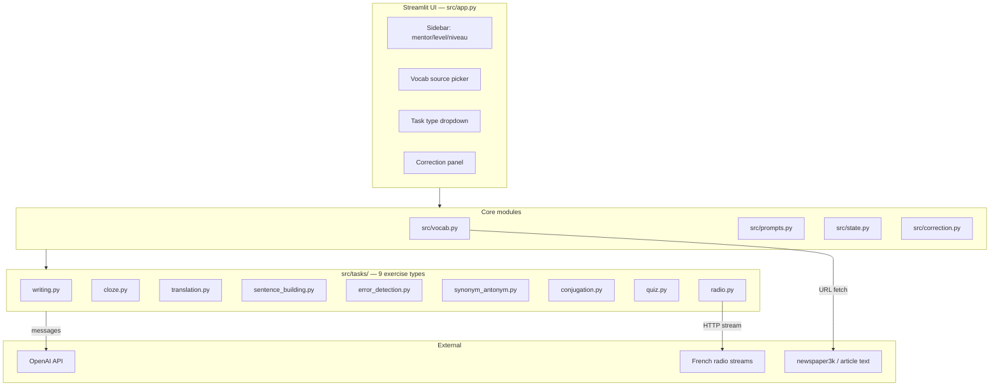

# Architecture

## Module boundaries

- **`config.py`** — all constants (languages, levels, mentors, themes, models, radio channels, task list). Pure, no imports outside stdlib.
- **`prompts.py`** — every prompt template lives here as a pure builder function. No API calls, no state. Trivially unit-testable.
- **`vocab.py`** — three vocabulary sources (file load, LLM extraction from text, LLM function-call generation) plus URL-to-text via `newspaper3k`.
- **`correction.py`** — splits inline `<meta-questions>` from user text, answers them separately, then runs the main correction pass.
- **`state.py`** — single `SessionState` dataclass replaces the scattered `st.session_state.foo = …` init blocks from the legacy monolith.
- **`tasks/`** — one module per exercise type. Each exports `build(client, **params) -> TaskInstruction`. The protocol (`base.py`) gives the UI a single shape to render.
- **`app.py` / `cli.py`** — entrypoints only. They wire sidebar widgets / CLI args to the task builders and the correction pipeline.

## Why this shape

The legacy app was a 619-line monolith with prompts embedded inside API-call statements. That made prompts un-reviewable side-by-side and un-testable without hitting the real OpenAI endpoint.

Splitting prompts into pure functions + test double (`tests/fake_openai.py`) means the entire task-generation layer is unit-testable offline. The 50+ existing tests run in under 100ms, so development doesn't need paid API calls for the fast iteration loop.
